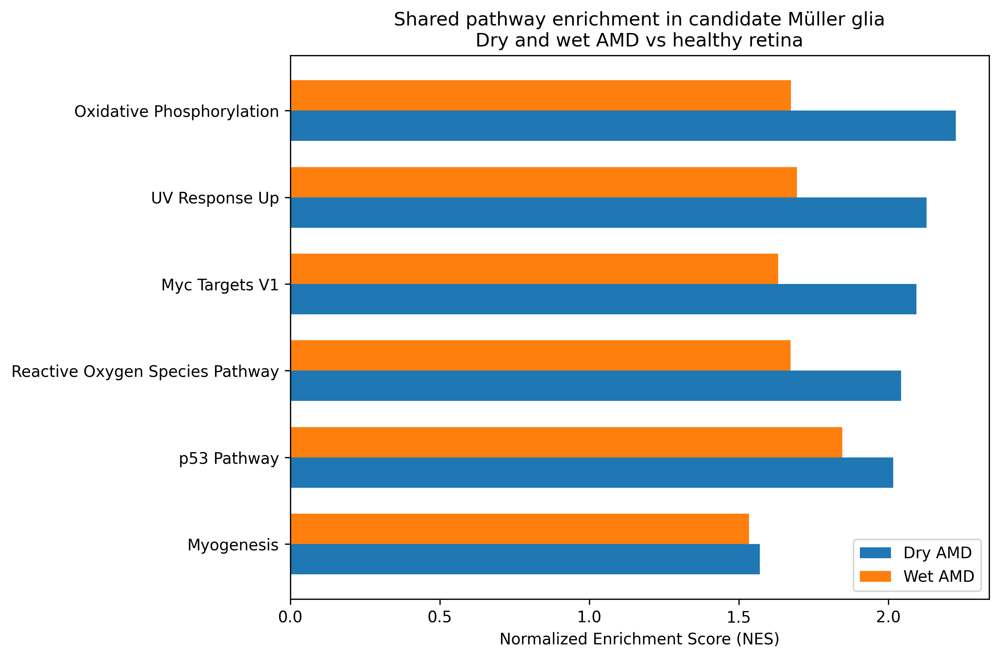

# Müller glial transcriptional states in age-related macular degeneration

Independent exploratory re-analysis of publicly available human retinal single-nucleus RNA-sequencing data.

## Question

Do Müller glia exhibit reproducible disease-associated transcriptional programs in dry and wet age-related macular degeneration (AMD)?

## Dataset

Public human retinal snRNA-seq dataset containing 70,973 nuclei from healthy, dry AMD and wet AMD retinal samples.

## Analysis

The workflow included:

- Expression-matrix reconstruction and preprocessing
- PCA and UMAP dimensionality reduction
- Leiden clustering
- Candidate Müller-glial identification using RLBP1, GLUL, SLC1A3 and RGR
- Extraction of 4,594 candidate Müller nuclei
- Donor-level pseudobulk aggregation
- Differential-expression analysis
- Hallmark gene-set enrichment analysis

After excluding donors with very low Müller-cell representation, 15 retinal samples were retained for donor-level analysis.

## Key result

Donor-aware pathway analysis identified:

- 13 significant Hallmark programs in dry AMD
- 8 significant Hallmark programs in wet AMD
- 6 significant programs shared across both disease groups

Shared programs included oxidative phosphorylation, reactive oxygen species response, p53 signaling and MYC Targets V1.

| Pathway | Dry AMD NES | Dry FDR | Wet AMD NES | Wet FDR |
|---|---:|---:|---:|---:|
| Oxidative phosphorylation | 2.23 | <0.001 | 1.67 | 0.029 |
| Reactive oxygen species | 2.04 | <0.001 | 1.67 | 0.022 |
| p53 pathway | 2.02 | 0.00025 | 1.85 | 0.014 |

## Interpretation

The analysis suggests a shared metabolic and cellular-stress-associated transcriptional state in AMD-associated Müller glia.

These findings are hypothesis-generating and do not establish mitochondrial dysfunction or causality.

## Proposed experimental follow-up

A useful next step would directly measure mitochondrial respiration, ATP generation, reactive oxygen species, membrane potential and cellular stress in a human retinal disease model, followed by pathway perturbation and measurement of photoreceptor survival or function.

## Limitations

- Independent re-analysis of public data
- Small number of independent donors
- Computationally inferred cell identity
- Limited donor-covariate adjustment
- Individual-gene differential expression did not survive FDR correction
- Transcriptomics alone cannot establish biological function or causality
